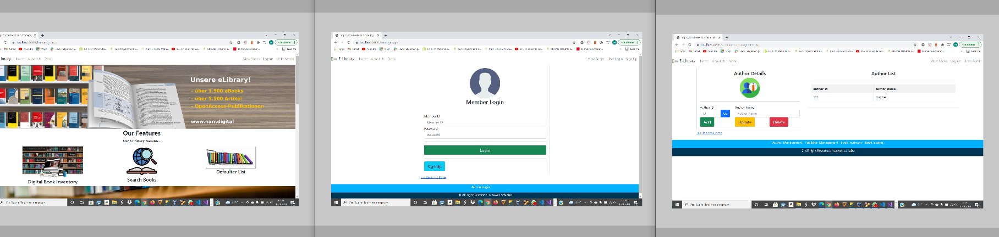

- [ZombieShooter](#ZombieShooter)
      
     - [FEATURES](#FEATURES)
          
     - [Screenshot](#Screenshot)
     
     - [INSTALLATION](#INSTALLATION)
     
     - [Technologie](#Technologie)
     
     - [Verwendete Quellen](#Verwendete-Quellen)
     
     
# ONLINELIBRARY (using C# and ASP.NET)

## FEATURES

    1. Admin login
    2. User login
    3.sign up
    4.logout
    5.view Books
    6.Author Management
    7.Publisher management
    8.Book Inventory
    9.Delete Users (Only for the Admin)
    10.Add / Delete Article (For Admin )

## Screenshot

## INSTALLATION

To install and run this project follow these steps:
1. clone this Repositorie on Githup https://github.com/maxwell-tchiabe/OnlineLibrary.git
2. install visual studio 2019
3.MS sql Server

## Technologie

1. C#
2. ASP.NET
3.Bootstrap
4. Ms sql Server

## Verwendete Quellen

- [youtube](https://www.youtube.com/watch?v=fH2wgReT0RI&list=PLIY8eNdw5tW_ZQawyxK0Dd1cZXwcNFWn8&index=18) (abruf 06.09.2021)

